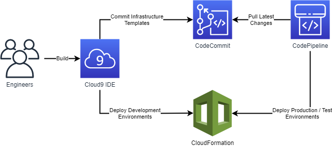

# Operational Excellence Best Practices

## Development

### OPS_DEV_01: Codify Infrastructure

In the cloud, you can apply the same engineering discipline that you use for 
application code to your entire environment. Define your Security Server infrastructure
as templates and scripts. Store the codified infrastructure in a version control system.
Make frequent, small, reversible changes to your templates and scripts. Apply code review
practices to reduce human errors.

**Recommended Tools**
* [AWS CloudFormation](https://aws.amazon.com/cloudformation/)
* [AWS Cloud Development Kit](https://aws.amazon.com/cdk/)
* [AWS CodeCommit](https://aws.amazon.com/codecommit/)
* [AWS Cloud9](https://aws.amazon.com/cloud9/)

**Example**

When working on Security Server setup, system engineers use Cloud9 as a co-working, online integrated development
environment to author infrastructure changes as code. Engineers use the Cloud Development Kit to work in a more
traditional programming language, synthesizing their infrastructure code into CloudFormation templates or work on 
CloudFormation templates directly. Templates are stored in a Git repository in CodeCommit and picked up by
CodePipeline to facilitate automated deployment.

### OPS_DEV_02: Test and Validate Changes

Similarly to how you can apply coding practices to both software and infrastructure, you 
should apply testing and validation practices to both. Build a pipeline that would deploy 
the latest version of the Security Server packages into a pre-production (test) environment.

**Recommended tools:**
* [AWS CloudFormation](https://aws.amazon.com/cloudformation/)
* [AWS CodePipeline](https://aws.amazon.com/codepipeline/)
* [CDK Pipelines](https://aws.amazon.com/blogs/developer/cdk-pipelines-continuous-delivery-for-aws-cdk-applications/)

**Example:**

AWS resources, like Security Server instances, databases and security groups are deployed in separate VPCs for 
different X-Road environments. Depending on your security and governance need, the consumer and producer information
systems can be either deployed into the same VPCs as corresponding Security Servers, into separate VPCs or into 
completely separate AWS accounts.

### OPS_DEV_03: Use Configuration Management

Manage and track configuration changes externally to the Security Servers, either through source control or a 
configuration management service. Store sensitive configuration 
(user credentials, keystore passwords etc.), in Secrets Manager, SSM Parameter Store or any 
other service that enables the safe handling of secret data. 

**Recommended tools:**
* [AWS Systems Manager](https://aws.amazon.com/systems-manager/)
* [AWS Secrets Manager](https://aws.amazon.com/secrets-manager/)

Configuration parameters that change over time can be stored in AWS Systems Manager Parameter Store. This allows
the parameters to be fetched when the Security Server starts. When using the containerized version of the security
server, the configuration can directly be referred to when setting up the environment for the container. Keep the
parameters containing secrets (usernames, passwords) in AWS Secrets Manager to enable automatic rotation. 

## Deployment

### OPS_DEP_01: Automate Deployment

Automate Security Server deployments, such that they are repeatable without user intervention. 
This minimizes human error in the deployment process, enables automated recovery from infrastructure
failures, and allows you to create test environments with relative ease. For more complex deployment processes use 
AWS Step Functions for coordination.

**Recommended tools:**
* [AWS CodePipeline](https://aws.amazon.com/codepipeline/)
* [AWS CodeDeploy](https://aws.amazon.com/codedeploy/)
* [AWS Step Functions](https://aws.amazon.com/step-functions/)

### OPS_DEP_02: Perform Rolling Deployments

When deploying a newer version of the Security Server, roll your environment gradually over to 
the new version, without impacting availability. For example, if your environment contains two
Security Servers in high availability configuration, start a deployment by deploying a third 
Security Server and direct some X-Road request traffic to that server. If the server
behaves as expected, decommission one of the original two servers and deploy a second copy 
of the new version, eventually finishing the deployment by terminating the second original 
Security Server. If at any point in this process, a Security Server or its infrastructure should 
fail, you will still have at least one healthy Security Server serving a part of the traffic.

**Recommended tools:**
* [EC2 Auto Scaling Groups](https://docs.aws.amazon.com/autoscaling/ec2/userguide/AutoScalingGroup.html)
* [CodeDeploy](https://aws.amazon.com/codedeploy/)

## Monitoring

### OPS_MON_01: Collect Logs and Metrics Centrally
 
Collect system logs and health metrics from Security Servers into a central log storage that 
can be used to analyze these and take action upon anomalies found in the logs.

Use Amazon CloudWatch Agent to collect logs from Security Servers. If the CloudWatch agent cannot be installed,
you can mount an Elastic File System share to your Security Server and write the logs to a mounted file system.
To store logs for a longer period of time, store these in S3. Configure S3 intelligent tiering to automatically
optimize your storage costs, depending on the frequency of access of logs.

**Recommended tools:**
* [Amazon CloudWatch](https://aws.amazon.com/cloudwatch/)
* [Amazon Elastic File System](https://aws.amazon.com/efs/)
* [Amazon S3](https://aws.amazon.com/s3/)
* [Amazon S3 Storage Classes](https://aws.amazon.com/s3/storage-classes/)
* [Amazon EventBridge](https://aws.amazon.com/eventbridge/)
* [AWS Lambda](https://aws.amazon.com/lambda/)

**Example:**

CloudWatch can be used as the central hub for collecting and working with near-realtime logs. One of the easiest ways
to collect logs to CloudWatch is by using the CloudWatch Agent. If using the agent is not an option, logs can be 
written to a mounted Elastic File System volume and delivered to CloudWatch using a periodically scheduled Lambda
function. If logs need to be stored for longer periods of time than actively used (e.g. for auditing purposes), a log
export task can be created periodically to export the specific log groups to S3 for long term storage.

### OPS_MON_02: Build a Monitoring Dashboard

Build a dashboard that surfaces the most critical metrics about Security Servers that you need
to assess system health. For example:
1. Server CPU and Memory usage
2. Number of errors detected in system logs over a period of x minutes
3. Number of healthy Security Servers
4. Number of failed health checks over a period of x minutes

Review and improve the metrics and dashboard periodically to minimize the time that it takes for you 
to diagnose problems occurring in your X-Road environments.

Recommended tools:
* [CloudWatch Dashboards](https://docs.aws.amazon.com/AmazonCloudWatch/latest/monitoring/CloudWatch_Dashboards.html)

### OPS_MON_03: Define Alarms

Define thresholds in health metrics that could indicate problems with Security Servers.
Use alarms to monitor these metrics and notify human operators when then thresholds have been
breached. For example:
1. Server CPU or Memory usage is over 80% for more than x data points.
2. More than x errors detected in system logs over a period of y minutes.
3. Number of healthy Security Servers drops below x% of the total.
4. A health check fails x times in a row.

Review and improve the thresholds, alarm triggers and notification content and mechanisms to 
decrease the number of false alarms, decrease the time it takes to receive a significant 
notification and decrease the time it takes for an operator from seeing the notification to
understanding the problem.

**Recommended tools:**
* [CloudWatch Alarms](https://docs.aws.amazon.com/AmazonCloudWatch/latest/monitoring/AlarmThatSendsEmail.html)

**Example:**

---
**Next Topic:** [Security](security.md)
