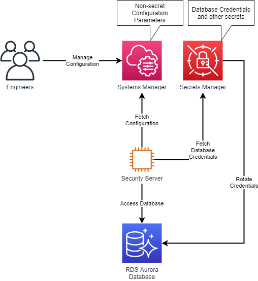

# Best Practices for Deploying X-Road Security Servers on AWS

## Operational Excellence

### Development

#### OPS_DEV_01: Codify Infrastructure

In the cloud, you can apply the same engineering discipline that you use for 
application code to your entire environment. Define your security server infrastructure
as templates and scripts. Store the codified infrastructure in a version control system.
Make frequent, small, reversible changes to your templates and scripts. Apply code review
practices to reduce human errors.

**Recommended Tools**
* [AWS CloudFormation](https://aws.amazon.com/cloudformation/)
* [AWS Cloud Development Kit](https://aws.amazon.com/cdk/)
* [AWS CodeCommit](https://aws.amazon.com/codecommit/)
* [AWS Cloud9](https://aws.amazon.com/cloud9/)

**Example**

When working on security server setup, system engineers use Cloud9 as a co-working, online integrated development
environment to author infrastructure changes as code. Engineers use the Cloud Development Kit to work in a more
traditional programming language, synthesizing their infrastructure code into CloudFormation templates or work on 
CloudFormation templates directly. Templates are stored in a Git repository in CodeCommit and picked up by
CodePipeline to facilitate automated deployment.

#### OPS_DEV_02: Test and Validate Changes

Similarly to how you can apply coding practices to both software and infrastructure, you 
should apply testing and validation practices to both. Build a pipeline that would deploy 
the latest version of the security server packages into a pre-production (test) environment.

**Recommended tools:**
* [AWS CloudFormation](https://aws.amazon.com/cloudformation/)
* [AWS CodePipeline](https://aws.amazon.com/codepipeline/)
* [CDK Pipelines](https://aws.amazon.com/blogs/developer/cdk-pipelines-continuous-delivery-for-aws-cdk-applications/)

**Example:**

AWS resources, like security server instances, databases and security groups are deployed in separate VPCs for 
different X-Road environments. Depending on your security and governance need, the consumer and producer information
systems can be either deployed into the same VPCs as corresponding security servers, into separate VPCs or into 
completely separate AWS accounts.

#### OPS_DEV_03: Use Configuration Management

Manage and track configuration changes externally to the security servers, either through source control or a 
configuration management service. Store sensitive configuration 
(user credentials, keystore passwords etc.), in Secrets Manager, SSM Parameter Store or any 
other service that enables the safe handling of secret data. 

**Recommended tools:**
* [AWS Systems Manager](https://aws.amazon.com/systems-manager/)
* [AWS Secrets Manager](https://aws.amazon.com/secrets-manager/)

Configuration parameters that change over time can be stored in AWS Systems Manager Parameter Store. This allows
the parameters to be fetched when the security server starts. When using the containerized version of the security
server, the configuration can directly be referred to when setting up the environment for the container. Keep the
parameters containing secrets (usernames, passwords) in AWS Secrets Manager to enable automatic rotation. 

### Deployment

#### OPS_DEP_01: Automate Deployment

Automate security server deployments, such that they are repeatable without user intervention. 
This minimizes human error in the deployment process, enables automated recovery from infrastructure
failures, and allows you to create test environments with relative ease. For more complex deployment processes use 
AWS Step Functions for coordination.

**Recommended tools:**
* [AWS CodePipeline](https://aws.amazon.com/codepipeline/)
* [AWS CodeDeploy](https://aws.amazon.com/codedeploy/)
* [AWS Step Functions](https://aws.amazon.com/step-functions/)

#### OPS_DEP_02: Perform Rolling Deployments

When deploying a newer version of the security server, roll your environment gradually over to 
the new version, without impacting availability. For example, if your environment contains two
security servers in high availability configuration, start a deployment by deploying a third 
security server and direct some X-Road request traffic to that server. If the server
behaves as expected, decommission one of the original two servers and deploy a second copy 
of the new version, eventually finishing the deployment by terminating the second original 
security server. If at any point in this process, a security server or its infrastructure should 
fail, you will still have at least one healthy security server serving a part of the traffic.

**Recommended tools:**
* [EC2 Auto Scaling Groups](https://docs.aws.amazon.com/autoscaling/ec2/userguide/AutoScalingGroup.html)
* [CodeDeploy](https://aws.amazon.com/codedeploy/)

### Monitoring

#### OPS_MON_01: Collect Logs and Metrics Centrally
 
Collect system logs and health metrics from security servers into a central log storage that 
can be used to analyze these and take action upon anomalies found in the logs.

Use Amazon CloudWatch Agent to collect logs from security servers. If the CloudWatch agent cannot be installed,
you can mount an Elastic File System share to your security server and write the logs to a mounted file system.
To store logs for a longer period of time, store these in S3. Configure S3 intelligent tiering to automatically
optimize your storage costs, depending on the frequency of access of logs.

**Recommended tools:**
* [Amazon CloudWatch](https://aws.amazon.com/cloudwatch/)
* [Amazon Elastic File System](https://aws.amazon.com/efs/)
* [Amazon S3](https://aws.amazon.com/s3/)
* [Amazon S3 Storage Classes](https://aws.amazon.com/s3/storage-classes/)
* [Amazon EventBridge](https://aws.amazon.com/eventbridge/)
* [AWS Lambda](https://aws.amazon.com/lambda/)

**Example:**

CloudWatch can be used as the central hub for collecting and working with near-realtime logs. One of the easiest ways
to collect logs to CloudWatch is by using the CloudWatch Agent. If using the agent is not an option, logs can be 
written to a mounted Elastic File System volume and delivered to CloudWatch using a periodically scheduled Lambda
function. If logs need to be stored for longer periods of time than actively used (e.g. for auditing purposes), a log
export task can be created periodically to export the specific log groups to S3 for long term storage.

#### OPS_MON_02: Build a Monitoring Dashboard

Build a dashboard that surfaces the most critical metrics about security servers that you need
to assess system health. For example:
1. Server CPU and Memory usage
2. Number of errors detected in system logs over a period of x minutes
3. Number of healthy security servers
4. Number of failed health checks over a period of x minutes

Review and improve the metrics and dashboard periodically to minimize the time that it takes for you 
to diagnose problems occurring in your X-Road environments.

Recommended tools:
* [CloudWatch Dashboards](https://docs.aws.amazon.com/AmazonCloudWatch/latest/monitoring/CloudWatch_Dashboards.html)

#### OPS_MON_03: Define Alarms

Define thresholds in health metrics that could indicate problems with security servers.
Use alarms to monitor these metrics and notify human operators when then thresholds have been
breached. For example:
1. Server CPU or Memory usage is over 80% for more than x data points.
2. More than x errors detected in system logs over a period of y minutes.
3. Number of healthy security servers drops below x% of the total.
4. A health check fails x times in a row.

Review and improve the thresholds, alarm triggers and notification content and mechanisms to 
decrease the number of false alarms, decrease the time it takes to receive a significant 
notification and decrease the time it takes for an operator from seeing the notification to
understanding the problem.

**Recommended tools:**
* [CloudWatch Alarms](https://docs.aws.amazon.com/AmazonCloudWatch/latest/monitoring/AlarmThatSendsEmail.html)

**Example:**

## Security

### Identity and Access Management

#### SEC_IAM_x: Grant Least Privilege Access

In test and production X-Road environments, minimize user privileges by whitelisting the users only to interact with 
the resources through the minimal set of operations required to perform their duty.

**Recommended tools:**
* [AWS IAM](https://aws.amazon.com/iam/)

#### SEC_IAM_x: Use Temporary Credentials

For workforce identities, use Single Sign-On (SSO), or federation with IAM, to access AWS accounts by assuming
roles. For users that require command-line access, ensure that they use AWS CLI v2 with SSO login. 
Security servers should be using IAM roles to access AWS services.

Use federated login for security server users, when possible.

**Recommended tools:**
* [AWS IAM](https://aws.amazon.com/iam/)
* [AWS STS](https://docs.aws.amazon.com/STS/latest/APIReference/welcome.html)
* [AWS CLI v2](https://docs.aws.amazon.com/cli/latest/userguide/install-cliv2.html)
* [Amazon EC2 Instance Profiles](https://docs.aws.amazon.com/IAM/latest/UserGuide/id_roles_use_switch-role-ec2_instance-profiles.html)

**Example:**

System administrators can log in to AWS accounts, using either AWS SSO identities or through federated identities from an 
already established identity provider (such as Active Directory). With the CLI version 2, SSO identities can be used for
command-line tools, removing the need for long-term credentials, such as IAM access keys.

#### SEC_IAM_x: Store and Use Secrets Securely

For credentials that are not IAM-related, like database usernames and passwords, use a service that is designed
to handle management of secrets (e.g. AWS Secrets Manager). Audit and rotate credentials frequently. Configure automatic 
rotation of database credentials.

**Recommended tools:**
* [AWS Secrets Manager](https://aws.amazon.com/secrets-manager/)
* [AWS Config](https://aws.amazon.com/config/)

### Detection

#### SEC_DET_x: Configure Service and Application Logging

Configure logging not only for security servers, but for the entire AWS account. Use AWS CloudTrail to log AWS account
activity, AWS Config to monitor and record resource configuration, Amazon GuardDuty for thread detection, 
and AWS Security Hub for collecting security alerts and findings in a single place.

**Recommended tools:**
* [AWS CloudTrail](https://aws.amazon.com/cloudtrail/)
* [AWS Config](https://aws.amazon.com/config/)
* [Amazon GuardDuty](https://aws.amazon.com/guardduty/)
* [AWS Security Hub](https://aws.amazon.com/security-hub/)
* [Amazon CloudWatch](https://aws.amazon.com/cloudwatch/)

#### SEC_DET_x: Analyze Logs, Findings and Metrics Centrally

Establish a way to access your logs, metrics and findings centrally to improve your ability to correlate events that
happen in separate parts of your system. Integrate security and monitoring events with your preferred event management
systems, like SIEM solutions, bug trackers or ticketing systems, allowing you to route and escalate findings quickly.

**Recommended tools:**
* [Amazon GuardDuty](https://aws.amazon.com/guardduty/)
* [AWS Security Hub](https://aws.amazon.com/security-hub/)

### Infrastructure Protection

#### SEC_IFP_x: Limit Network Access

Use security groups to limit incoming traffic to only the ports required for communications from the consumer 
information system (internally) and from other security servers (externally). Limit access to the database cluster
only from security servers to the primary database connection port. Layer your networks - have your security servers,
information systems and databases deployed on separate network layers to have the most control over network traffic
on the layer boundaries.

**Recommended tools:**
* [Amazon EC2 Security Groups](https://docs.aws.amazon.com/AWSEC2/latest/UserGuide/ec2-security-groups.html)

#### SEC_IFP_x: Limit Human Operator Access

Disable SSH access to security servers. Use AWS System Manager sessions to connect to the security servers on the 
rare (break-glass) occasions when interactive human access is required. Do not allow direct operator access to the 
databases.

**Recommended tools:**
* [AWS Systems Manager Session Manager](https://docs.aws.amazon.com/systems-manager/latest/userguide/session-manager.html)

### Data Protection

#### SEC_DTP_x: Enforce Encryption at Rest and in Transit

Configure storage volumes and databases to be encrypted at rest. Create your own encryption keys, instead of 
default service-managed keys. If you need to be able to completely and immediately remove an encryption key 
from the AWS environment, provide your own key material that you keep a secure copy of outside AWS. Audit the
use of encryption keys. Make sure that encryption is enabled by default.

Enforce TLS for communications between security servers and consumer / producer information systems. Enable secure
communication between security servers and the security server database cluster. Authenticate network communications, 
where possible.

**Recommended tools:**
* [AWS Key Management Service](https://aws.amazon.com/kms/)

### Incident Response

#### SEC_INC_x: Plan for Incidents

Ensure that incident responders have correct access pre-provisioned into AWS environments to reduce the time for 
investigation through to recovery. Pre-deploy necessary tools for incident response. Run game days (exercises) to
practice your incident management plans and procedures. Automate containment and recovery capabilities.

**Recommended tools:**
* [AWS Fault Injection Simulator](https://aws.amazon.com/fis/)

## Reliability

### Architecture

#### REL_ARC_x: Define Recovery Time and Point Objectives

Understand the criticality of your X-Road infrastructure to your customers - internal and external. Define how fast
do you need to recover from a failure (Recovery Time Objective, RTO) and how much data loss can you tolerate (Recovery
Point Objective, RPO). Adjust your backup methods and frequency accordingly. Align these objectives with the objectives
of your customers to avoid X-Road infrastructure becoming the weakest link in the system, but also to avoid cost 
overheads.

**Recommended tools:**
* [Example Implementations for Availability Goals](https://docs.aws.amazon.com/wellarchitected/latest/reliability-pillar/example-implementations-for-availability-goals.html)

#### REL_ARC_x: Separate Compute and Storage

By separating storage from the compute layer, it becomes easier to replace and scale each separately. For security servers
running as EC2 instances, you can pick between EBS volumes or EFS file systems for storage. With sidecar container deployments, 
mounting EFS file systems is the best option for persistent storage. 

Prefer using an Amazon RDS database over the built-in PostgreSQL option for best performance and availability.

**Recommended tools:**
* [Amazon Elastic Block Store](https://aws.amazon.com/ebs/)
* [Amazon Elastic File System](https://aws.amazon.com/efs/)
* [Amazon Relational Database Service](https://aws.amazon.com/rds/)

#### REL_ARC_x: Scale Horizontally to Increase Availability

Instead of one large security servers, deploy multiple small ones to reduce the impact of a single failure on the 
overall workload. Distribute requests across security servers to ensure that they don’t share a common point of 
failure.

**Recommended tools:**
* [Amazon EC2 Auto Scaling Groups](https://docs.aws.amazon.com/autoscaling/ec2/userguide/AutoScalingGroup.html)

### Change Management

#### REL_CHM_x: Integrate Testing as Part of Your Deployment

Before deploying an updated version of a security server to a production environment, deploy it in a test environment.
Run automated integration tests that involve connecting to / from the subsystem(s) behind the security server. 
Verify that the security server management UI is available for operator access. When tests succeed, deploy the changes
into a production environment.

#### REL_CHM_x: Deploy Using Immutable Infrastructure

Prefer separately staged changes to the security servers to in-place changes. Build security server images periodically
up-front in an automated build pipeline to get the latest versions of required operating system packages. Disable 
automatic in-place upgrades of packages on the security server in favor of replacing the security servers from the
latest verified machine image.

**Recommended tools:**
* [Amazon Machine Images](https://docs.aws.amazon.com/AWSEC2/latest/UserGuide/AMIs.html)

#### REL_CHM_x: Deploy With Automation

Minimize the risk of human error by automating security server deployments. Automate both roll-forward and roll-back
scenarios, such that any deployment can be stopped and reverted when needed. Integrate deployment automation with 
canary tests, such that you can assess system health during and after the deployment has occurred. 

### Failure Management

#### REL_FLM_x: Back Up Data

Configure automatic backups for security server databases, through RDS snapshots and point-in-time recovery. Configure
logs to be backed up to S3 in addition to CloudWatch for auditing purposes. Periodically verify that backups can be
used in a disaster recovery scenario.

Recommended tools:
* [Amazon RDS Backups](https://docs.aws.amazon.com/AmazonRDS/latest/UserGuide/USER_WorkingWithAutomatedBackups.html)

#### REL_FLM_x: Design to Withstand Component Failures

Run at least two security server instances behind a load balancer in separate availability zones, with at least two 
database instances (writer and reader) in the same availability zones for lowest latency and minimum downtime in the 
situation of component failure. Configure health checks on security servers to allow for the auto-scaling group to 
replace a failed instance.

For sidecar security servers (container-based deployments), define your workload as an ECS or EKS service, to let
the container platform manage the lifecycles of security server containers.

#### REL_FLM_x: Test Reliability

Periodically verify recovery procedures. Adopt chaos engineering principles to introduce failures in your security
server environment. Verify that you can quickly recover from database failures or corruptions. Verify recovery from
the loss of a single security server instance.

**Recommended tools:**
* [AWS Fault Injection Simulator](https://aws.amazon.com/fis/)

## Performance Efficiency

### Selection

#### PRF_SEL_x: Pick the Right Compute Option

Test your security server performance to pick the best instance or compute type to run your security server workload.
Additionally, consider how the security server fits into your service development and operations landscape. For example,
if you are looking to deploy a standalone security server in front of multiple services and the security server would
be managed by a dedicated team experienced in server administration, deploying as an EC2 instance could be the best fit.
On the other hand, if the security server is directly coupled to a single containerized service and would benefit from sharing 
deployment and operations best practices with the service, deploying the security server sidecar container on top of 
either Elastic Container Service (ECS) or Elastic Kubernetes Service (EKS) would be the best way to go.

For EC2-based security servers:
- c5.large, c5a.large for better CPU performance at a lower cost
- t3.medium, t3a.medium for a better price point when there's no sustained load on the CPU
- m5.large, m5a.large when running low on memory

For ECS and EKS based container deployments:
- Prefer Fargate as the compute engine to reduce server management overhead.
- If Fargate is not an option, use the same guidance as for EC2-based security servers when picking a container host.

**Recommended tools:**
* [Amazon EC2](https://aws.amazon.com/ec2)
* [Amazon Elastic Container Service](https://aws.amazon.com/ecs)
* [Amazon Elastic Kubernetes Service](https://aws.amazon.com/eks)

#### PRF_SEL_x: Pick the Right Database Option

Prefer AWS-managed database services over self-managed database options. Use Amazon Aurora PostgreSQL or Amazon Aurora
Serverless (where available), for best availability and minimal management requirements.

**Recommended tools:**
* [Amazon Aurora](https://aws.amazon.com/rds/aurora/)
* [Amazon Aurora Serverless](https://aws.amazon.com/rds/aurora/serverless/)

### Review

#### PRF_REV_x: Evaluate Performance Over Time

Stay up-to-date on new resources and services. Evaluate ways to improve performance as new instance types, compute
options or database services are launched.

### Monitoring

#### PRF_MON_x: Monitor Your Resources for Performance

Measure the performance characteristics of your security servers over time and use this information to adjust the
infrastructure setup of your X-Road environments. Analyze metrics when events or incidents occur, to understand and
diagnose the impact. Establish Key Performance Indicators, such as API latency, to quantify the performance experience
expected by your customers.

**Recommended tools:**
* [Amazon CloudWatch](https://aws.amazon.com/cloudwatch/)

## Cost Optimization

### Financial Management

#### CST_FNM_x: Quantify Business Value Delivered From Cost Optimization

Quantify how much it costs to receive or send a single X-Road request in your environment. Consider not only the 
infrastructure costs, but also the recurring costs of managing the infrastructure (engineer time) and costs of 
incidents (incident response time, loss of trust / business). Consider environmental impact and sustainability
as a part of delivering business value in a responsible manner.

### Expenditure Awareness

#### CST_EXA_x: Monitor Cost and Usage

Use the Billing Console, Cost Explorer with hourly granularity enabled and create a Cost and Usage Report to get the
most accurate view of cost and usage across your entire organization. When possible, assign organization meaning to
cost and usage by tagging your resources. This allows you to understand how your X-Road infrastructure costs relate
to the cost of your entire infrastructure.

**Recommended tools:**
* [AWS Billing and Cost Management](https://docs.aws.amazon.com/awsaccountbilling/latest/aboutv2/billing-what-is.html)

### Cost Effective Resources

#### CST_RES_x: Select the Best Pricing Model

AWS has multiple [pricing models](http://aws.amazon.com/pricing/) that allow you to pay for your resources in the most 
cost-effective way that suits your organization’s needs. Use On Demand or Spot capacity (if available) for short-lived 
security server instances, such as extra capacity to handle peak workloads or capacity to run ad hoc testing 
environments. Use Compute Savings Plans or EC2 Instance Savings Plans for the bulk of your security server workload 
to reduce server costs.

**Recommended tools:**
* [Savings Plans](https://aws.amazon.com/savingsplans/)