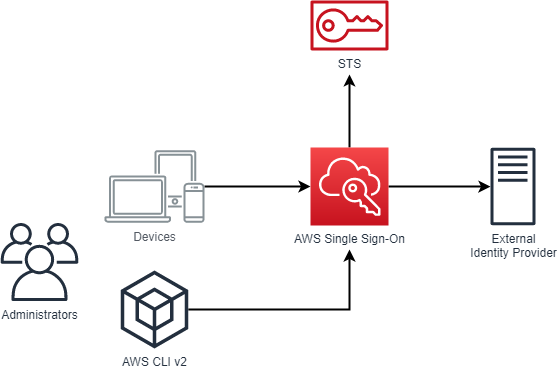
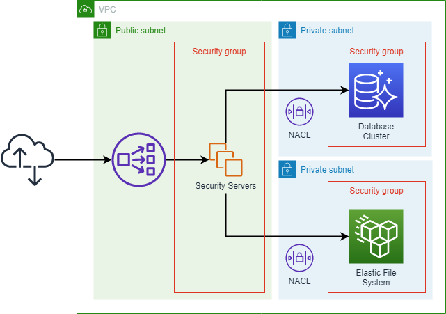

# Security Best Practices

## Identity and Access Management

### SEC_IAM_x: Grant Least Privilege Access

In test and production X-Road environments, minimize user privileges by whitelisting the users only to interact with 
the resources through the minimal set of operations required to perform their duty.

**Recommended tools:**
* [AWS IAM](https://aws.amazon.com/iam/)

### SEC_IAM_x: Use Temporary Credentials

For workforce identities, use Single Sign-On (SSO), or federation with IAM, to access AWS accounts by assuming
roles. For users that require command-line access, ensure that they use AWS CLI v2 with SSO login. 
Security Servers should be using IAM roles to access AWS services.

Use federated login for Security Server users, when possible.

**Recommended tools:**
* [AWS IAM](https://aws.amazon.com/iam/)
* [AWS STS](https://docs.aws.amazon.com/STS/latest/APIReference/welcome.html)
* [AWS CLI v2](https://docs.aws.amazon.com/cli/latest/userguide/install-cliv2.html)
* [Amazon EC2 Instance Profiles](https://docs.aws.amazon.com/IAM/latest/UserGuide/id_roles_use_switch-role-ec2_instance-profiles.html)

**Example:**

System administrators can log in to AWS accounts, using either AWS SSO identities or through federated identities from an 
already established identity provider (such as Active Directory). With the CLI version 2, SSO identities can be used for
command-line tools, removing the need for long-term credentials, such as IAM access keys.

### SEC_IAM_x: Store and Use Secrets Securely

For credentials that are not IAM-related, like database usernames and passwords, use a service that is designed
to handle management of secrets (e.g. AWS Secrets Manager). Audit and rotate credentials frequently. Configure automatic 
rotation of database credentials. When required, use a Hardware Security Module (e.g. AWS CloudHSM) for storing encryption 
keys.

**Recommended tools:**
* [AWS Secrets Manager](https://aws.amazon.com/secrets-manager/)
* [AWS Config](https://aws.amazon.com/config/)
* [AWS CloudHSM](https://aws.amazon.com/cloudhsm/)

## Detection

### SEC_DET_x: Configure Service and Application Logging

Configure logging not only for Security Servers, but for the entire AWS account. Use AWS CloudTrail to log AWS account
activity, AWS Config to monitor and record resource configuration, Amazon GuardDuty for thread detection, 
and AWS Security Hub for collecting security alerts and findings in a single place.

**Recommended tools:**
* [AWS CloudTrail](https://aws.amazon.com/cloudtrail/)
* [AWS Config](https://aws.amazon.com/config/)
* [Amazon GuardDuty](https://aws.amazon.com/guardduty/)
* [AWS Security Hub](https://aws.amazon.com/security-hub/)
* [Amazon CloudWatch](https://aws.amazon.com/cloudwatch/)

### SEC_DET_x: Analyze Logs, Findings and Metrics Centrally

Establish a way to access your logs, metrics and findings centrally to improve your ability to correlate events that
happen in separate parts of your system. Integrate security and monitoring events with your preferred event management
systems, like SIEM solutions, bug trackers or ticketing systems, allowing you to route and escalate findings quickly.

**Recommended tools:**
* [Amazon GuardDuty](https://aws.amazon.com/guardduty/)
* [AWS Security Hub](https://aws.amazon.com/security-hub/)

## Infrastructure Protection

### SEC_IFP_x: Limit Network Access

Use security groups to limit incoming traffic to only the ports required for communications from the consumer 
information system (internally) and from other Security Servers (externally). Limit access to the database cluster
only from Security Servers to the primary database connection port. Layer your networks - have your Security Servers,
information systems and databases deployed on separate network layers to have the most control over network traffic
on the layer boundaries.

**Recommended tools:**
* [Amazon EC2 Security Groups](https://docs.aws.amazon.com/AWSEC2/latest/UserGuide/ec2-security-groups.html)

### SEC_IFP_x: Limit Human Operator Access

Disable SSH access to Security Servers. Use AWS System Manager sessions to connect to the Security Servers on the 
rare (break-glass) occasions when interactive human access is required. Do not allow direct operator access to the 
databases.

**Recommended tools:**
* [AWS Systems Manager Session Manager](https://docs.aws.amazon.com/systems-manager/latest/userguide/session-manager.html)

## Data Protection

### SEC_DTP_x: Enforce Encryption at Rest and in Transit

Configure storage volumes and databases to be encrypted at rest. Create your own encryption keys, instead of 
default service-managed keys. If you need to be able to completely and immediately remove an encryption key 
from the AWS environment, provide your own key material that you keep a secure copy of outside AWS. Audit the
use of encryption keys. Make sure that encryption is enabled by default.

Enforce TLS for communications between Security Servers and consumer / producer information systems. Enable secure
communication between Security Servers and the Security Server database cluster. Authenticate network communications, 
where possible.

**Recommended tools:**
* [AWS Key Management Service](https://aws.amazon.com/kms/)

## Incident Response

### SEC_INC_x: Plan for Incidents

Ensure that incident responders have correct access pre-provisioned into AWS environments to reduce the time for 
investigation through to recovery. Pre-deploy necessary tools for incident response. Run game days (exercises) to
practice your incident management plans and procedures. Automate containment and recovery capabilities.

**Recommended tools:**
* [AWS Fault Injection Simulator](https://aws.amazon.com/fis/)

---

**Previous Topic:** [Operational Excellence](operational-excellence.md)

**Next Topic:** [Reliability](reliability.md)